# ESS Application Architecture

## 1. System Overview

The **ESS Application** is an Employee Self-Service (ESS) mobile application built with **Flutter** and **Dart**. The system is designed to streamline workforce management workflows including real-time location-based attendance tracking, leave applications, unified request tracking, payroll and payslip inspection, structured PDF document generation, and HR administration.

The application strictly follows a **Clean Layered Architecture** pattern, enforcing clear separation of concerns across presentation, state management, business services, repository abstractions, and data providers:

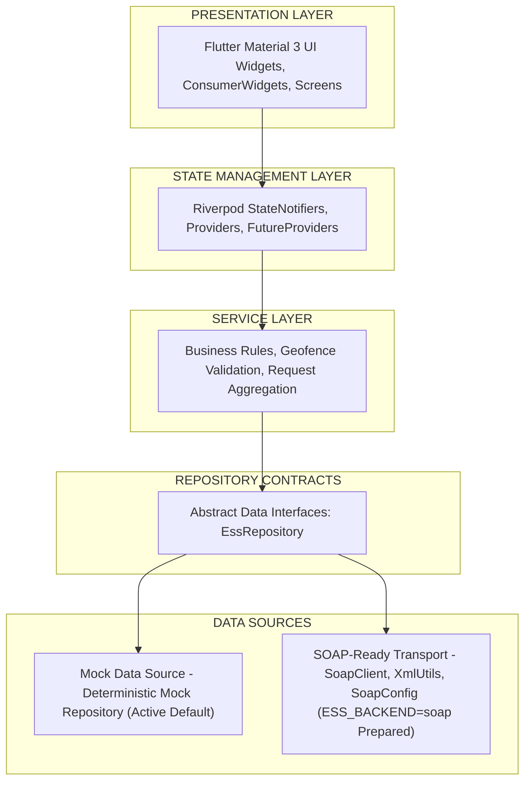

Key Architectural Principles:
- **Separation of Concerns**: UI widgets handle layout only; state and business logic reside inside Riverpod providers and services.
- **Repository Pattern**: Data access is decoupled from business logic via abstract interface contracts (`EssRepository`, `AuthRepository`, `AttendanceRepository`, etc.).
- **Backend Portability**: The app supports instant compile-time backend switching between a local deterministic Mock data source and a SOAP/XML client layer using `--dart-define=ESS_BACKEND=soap`.
- **Zero-Trust Validation**: Critical actions like location-based attendance check-ins perform dual-layer validation (GPS accuracy threshold and 50m geofence distance calculation).
- **Telemetry Safety**: Telemetry is abstracted behind `AnalyticsService`, ensuring fallback protection and zero leakage of sensitive personal data.

---

## 2. High-Level Architecture Diagram

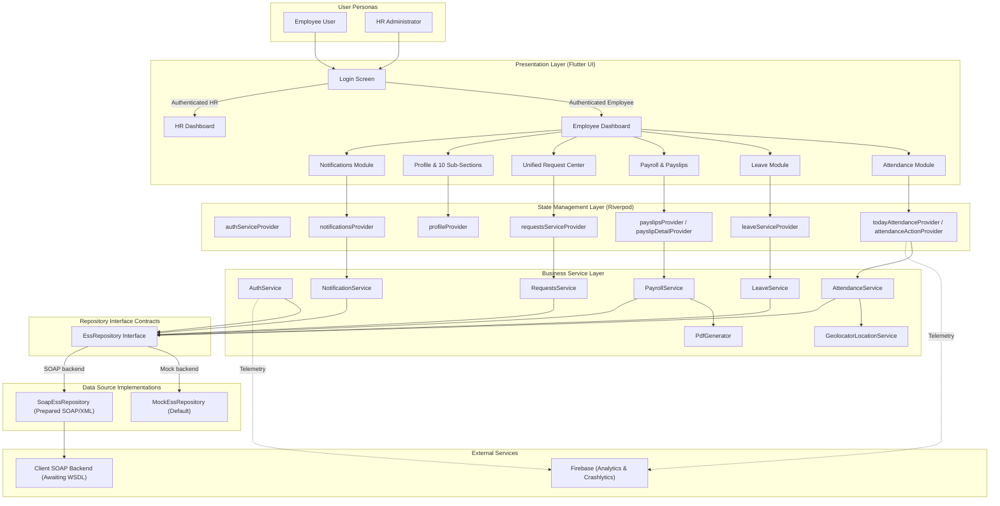

---

## 3. Project Folder Architecture

```mermaid
flowchart TD
    subgraph Root ["lib / Directory Structure"]
        MAIN["main.dart (Entry Point & Firebase Init)"]
        APP["app.dart (MaterialApp & Routes)"]

        subgraph Core ["core/"]
            CONST["constants/app_constants.dart"]
            ERR["errors/app_exceptions.dart"]
            PROV["providers/injection_providers.dart"]
            SVC["services/analytics_service.dart"]
            THEME["theme/app_theme.dart"]
            UTIL["utils/ (session_manager, pdf_generator, logger)"]
            WIDGETS["widgets/ (custom_text_field, service_card, empty_state)"]
        end

        subgraph Features ["features/"]
            F_AUTH["auth/ (login, bootstrap)"]
            F_ATT["attendance/ (attendance_screen, attendance_provider)"]
            F_DASH["dashboard/ (dashboard_screen, dashboard_provider)"]
            F_LEAVE["leave/ (leave_screen, apply_leave_screen)"]
            F_PAY["payslip/ & pay_summary/"]
            F_REQ["requests/ (requests_screen, requests_provider)"]
            F_NOTIF["notifications/ (notifications_screen)"]
            F_PROF["profile/ (10 landing sub-screens)"]
            F_DOCS["documents/ (documents_screen)"]
            F_HR["hr/ (dashboard, employees, leaves, payslips)"]
            F_OTHER["airfare, claims, education, overtime, reimbursement"]
        end

        subgraph Models ["models/"]
            M_USER["employee, auth_result, personal_info"]
            M_BIZ["attendance, leave, payslip, pay_summary"]
            M_REQ["unified_request, pending_request, reimbursement"]
        end

        subgraph Nav ["navigation/"]
            NAV["main_navigation.dart (Bottom Navigation Bar)"]
        end

        subgraph Repos ["repositories/"]
            R_INT["ess_repository.dart (Contracts)"]
            R_MOCK["mock_ess_repository.dart"]
            R_SOAP["soap_ess_repository.dart"]
        end

        subgraph Svcs ["services/"]
            S_BIZ["auth, attendance, leave, payroll, requests, profile"]
            S_LOC["location_service.dart (Geolocator)"]
            S_SOAP["soap/ (soap_client, soap_config, xml_utils)"]
        end
    end

    MAIN --> APP
    APP --> Core
    APP --> Nav
    APP --> Features
    Features --> Models
    Features --> Svcs
    Svcs --> Repos
```

---

## 4. Technology Stack

| Architecture Component | Technology / Library | Version / Configuration |
| :--- | :--- | :--- |
| **Framework** | Flutter | SDK `^3.12.1` |
| **Language** | Dart | 3.x |
| **UI Framework** | Material Design 3 | Light Theme, Primary Blue (`#1E88E5`), Cupertino Icons `^1.0.8`, Google Fonts `^8.2.1`, Intl `^0.20.3` |
| **State Management** | Riverpod | `flutter_riverpod: ^2.6.1`, `riverpod_annotation: ^2.6.1`, Code-Gen (`riverpod_generator: ^2.6.2`) |
| **Navigation** | Flutter Named Routes | `MaterialApp` routes + `onGenerateRoute`, `GlobalKey<NavigatorState>` navigatorKeyProvider |
| **Session & Storage** | Flutter Secure Storage | `flutter_secure_storage: ^9.2.4` via `SessionManager` (Encrypted keystore/keychain) |
| **Firebase Analytics** | Firebase Analytics | `firebase_analytics: ^12.6.0` (4 custom events: `login_success`, `attendance_marked`, `request_submitted`, `notification_opened`) |
| **Crash Reporting** | Firebase Crashlytics | `firebase_crashlytics: ^5.4.0` (Fatal error handling, async dispatcher, custom keys) |
| **Firebase Core** | Firebase Core | `firebase_core: ^4.15.0` (`DefaultFirebaseOptions.currentPlatform`) |
| **PDF Generation** | PDF & Printing | `pdf: ^3.11.1`, `printing: ^5.11.1`, `path_provider: ^2.1.2`, `share_plus: ^10.1.3` |
| **Location & GPS** | Geolocator | `geolocator: ^13.0.4` (High accuracy, Haversine formula, geofencing) |
| **Testing** | Flutter Test Framework | `flutter_test`, `custom_lint: ^0.7.0`, `riverpod_lint: ^2.6.1`, `flutter_lints: ^6.0.0` (27 test suites, 99 tests) |
| **Backend Architecture** | Repository Pattern | Toggleable via `--dart-define=ESS_BACKEND=mock` or `soap`. Prepared SOAP layer (`SoapClient`, `XmlUtils`, `SoapConfig`) |
| **Build & Tooling** | Android Gradle Plugin | Gradle KTS, Kotlin JVM 17, Minification / R8 Shrinking, `flutter_launcher_icons: ^0.14.4`, `flutter_native_splash: ^2.4.4` |
| **Version Control** | Git / GitHub | Git workflow |

*Note: Technologies not present in pubspec.yaml/code (e.g., FCM, Firestore, Storage, Auth, Remote Config) are strictly omitted.*

---

## 5. Employee Workflow

```mermaid
flowchart TD
    subgraph AuthStep ["Authentication Flow"]
        START([App Launch]) --> BOOT["Bootstrap Screen: restoreSession"]
        BOOT -->|Session Active| MAIN_NAV
        BOOT -->|No Session| LOGIN_SCR["Login Screen"]
        LOGIN_SCR -->|Authenticate Credentials| AUTH_VAL{Success?}
        AUTH_VAL -->|No| LOGIN_ERR["Show Auth Error"] --> LOGIN_SCR
        AUTH_VAL -->|Yes| SAVE_SESS["Save Session & Role"] --> MAIN_NAV["Main Navigation Hub"]
    end

    subgraph Dashboard ["Dashboard Hub"]
        MAIN_NAV --> DASH["Home Dashboard"]
        DASH --> BANNER["Attendance Status Card"]
        DASH --> NOTIF_BADGE["Unread Notifications Count"]
        DASH --> PAY_CARD["Latest Net Pay Card"]
        DASH --> REQ_METRIC["Pending Requests Metrics"]
    end

    subgraph SubFlows ["Module Subflows"]
        DASH -->|Tap Attendance| ATT_MOD["Attendance Screen"]
        DASH -->|Tap Leave| LEAVE_MOD["Leave Screen"]
        DASH -->|Tap Requests| REQ_MOD["Unified Request Center"]
        DASH -->|Tap Payslips| PAY_MOD["Payslip History Screen"]
        DASH -->|Tap Pay Summary| SUM_MOD["Pay Summary Screen"]
        DASH -->|Tap Notifications| NOTIF_MOD["Notifications Screen"]
        DASH -->|Tap Profile| PROF_MOD["Profile Screen"]
        DASH -->|Tap Documents| DOCS_MOD["My Documents Screen"]
    end

    subgraph AttDetails ["Attendance Subflow"]
        ATT_MOD --> GPS_CHK["GPS Location & Accuracy Check"]
        GPS_CHK --> GEO_CHK{Within 50m & Accuracy <= 100m?}
        GEO_CHK -->|No| ATT_ERR["Show Geofence or Accuracy Warning"]
        GEO_CHK -->|Yes| ATT_ACT{Action Status}
        ATT_ACT -->|Not Marked| CHECK_IN["Execute Check In"] --> LOG_ATT["Log analytics: attendance_marked"]
        ATT_ACT -->|Checked In| CHECK_OUT["Execute Check Out"] --> LOG_ATT
    end

    subgraph LeaveDetails ["Leave Subflow"]
        LEAVE_MOD --> APPLY_LV["Apply Leave Screen"]
        APPLY_LV --> SUBMIT_LV["Submit Leave Request"] --> LOG_REQ["Log analytics: request_submitted"]
        SUBMIT_LV --> LV_STATUS["View Pending/Approved Status"]
    end

    subgraph PayDetails ["Payroll Subflow"]
        PAY_MOD --> PAY_DET["Payslip Detail Screen"]
        PAY_DET --> GEN_PDF["PdfGenerator.generatePayslipPdf"]
        GEN_PDF --> SHARE_PDF["Download or Share PDF via share_plus"]
    end

    subgraph NotifDetails ["Notifications Subflow"]
        NOTIF_MOD --> OPEN_N["Tap Notification Item"] --> LOG_NOTIF["Log analytics: notification_opened"]
        LOG_NOTIF --> DEEP_LINK["Deep Link Navigation to Target Module"]
    end

    subgraph ProfileDetails ["Profile Subflow"]
        PROF_MOD --> LANDING["Personal Info Landing - 10 Sub-sections"]
        LANDING --> SUB_SECTIONS["Basic, Family, Bank, Education, Skills, Identity, Work, Certs, Docs, Requests"]
    end

    subgraph LogoutStep ["Logout Flow"]
        PROF_MOD --> TAP_LOGOUT["Tap Logout Account"]
        TAP_LOGOUT --> CLEAR_SESS["SessionManager.clearSession"]
        CLEAR_SESS --> LOGIN_SCR
    end
```

---

## 6. HR Workflow

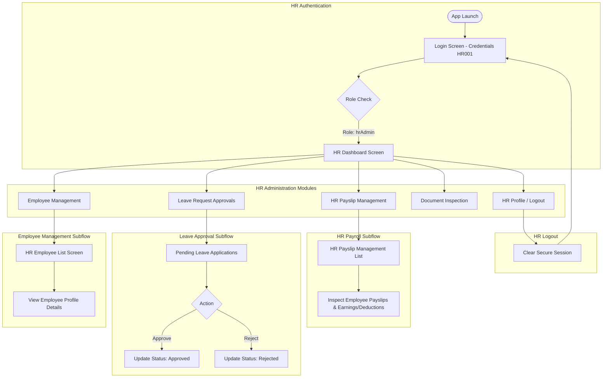

---

## 7. Authentication & Session Architecture

The application implements encrypted session handling via `FlutterSecureStorage` through the `SessionManager` helper utility and `AuthService`.

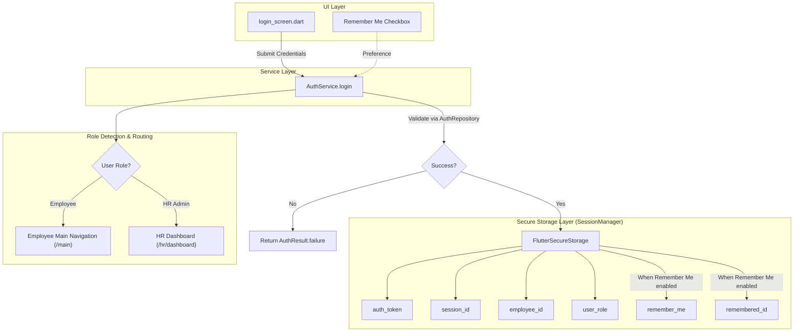

### Session Lifecycle Rules
1. **App Bootstrap (`bootstrap_screen.dart`)**: On initial launch, `AuthService.restoreSession()` checks `SessionManager.hasSession()`. If true, the user is navigated directly to `/main` or `/hr/dashboard` based on stored `user_role`.
2. **Remember Me**: When enabled, `remembered_id` is persisted in secure storage and pre-filled in the login ID field upon session expiration or explicit logout.
3. **Logout (`AuthService.logout`)**: Invoking logout clears `auth_token`, `session_id`, `employee_id`, and `user_role` from `FlutterSecureStorage`, resetting the root navigator to `/login`.

---

## 8. State Management Architecture

The project utilizes **Riverpod** (`flutter_riverpod: ^2.6.1`) for unidirectional data flow:

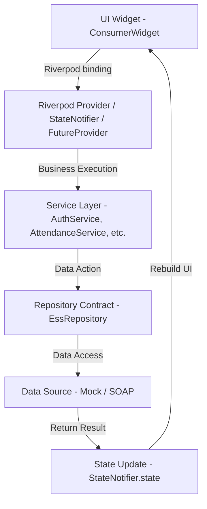

### Primary Application Providers

| Provider Name | Provider Type | Responsibilities |
| :--- | :--- | :--- |
| `analyticsServiceProvider` | `Provider<AnalyticsService>` | Exposes global telemetry logging contract |
| `navigatorKeyProvider` | `Provider<GlobalKey<NavigatorState>>` | Supports context-less global navigation |
| `essRepositoryProvider` | `Provider<EssRepository>` | Reads `ESS_BACKEND` env and injects Mock or SOAP repository |
| `authServiceProvider` | `Provider<AuthService>` | Handles login, session management, remember me, and logout |
| `attendanceServiceProvider` | `Provider<AttendanceService>` | Manages attendance logic, GPS coordinates, and distance rules |
| `todayAttendanceProvider` | `FutureProvider<AttendanceRecord>` | Fetches and caches current day attendance status |
| `attendanceLocationProvider` | `FutureProvider<LocationResult>` | Fetches real-time GPS coordinates and geofence evaluation |
| `attendanceActionProvider` | `StateNotifierProvider` | Coordinates check-in/out actions and triggers `attendance_marked` telemetry |
| `requestsServiceProvider` | `Provider<RequestsService>` | Aggregates requests across 7 modules into unified items |
| `requestsFilterProvider` | `StateProvider<RequestFilterState>` | Manages category and status filter selection in Request Center |
| `filteredRequestsProvider` | `FutureProvider<List<UnifiedRequest>>` | Computes filtered requests list based on active filters |
| `notificationsProvider` | `FutureProvider<List<AppNotification>>` | Fetches notification stream |
| `unreadNotificationCountProvider` | `Provider<int>` | Computes unread notification count badge for top app bar |
| `payslipsProvider` | `FutureProvider<List<Payslip>>` | Fetches annual payslip history |
| `payslipDetailProvider` | `FutureProviderFamily<PayslipDetail>` | Fetches detailed earnings and deductions breakdown for year/month |
| `profileProvider` | `FutureProvider<Employee>` | Fetches employee profile details |

---

## 9. Service / Repository Architecture

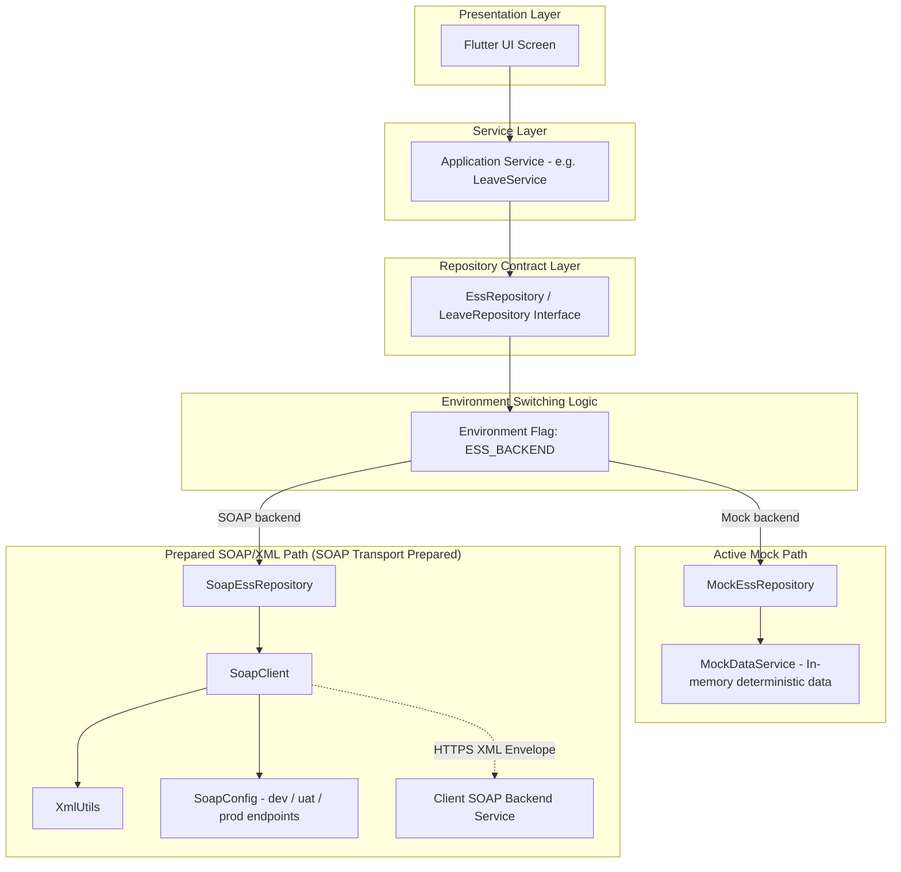

*Architectural Note on Backend Integration*:
The repository abstraction layer is implemented and prepared for client SOAP integration. The app runs default mock data seamlessly. The `SoapEssRepository`, `SoapClient`, `XmlUtils`, and `SoapConfig` files provide the transport layer structure. Real network requests to SOAP operations throw an `IntegrationException` until the client provides the official WSDL and service schemas.

---

## 10. Attendance Architecture

The Attendance module integrates real device GPS location through `GeolocatorLocationService` and enforces office geofencing rules before allowing check-in or check-out operations.

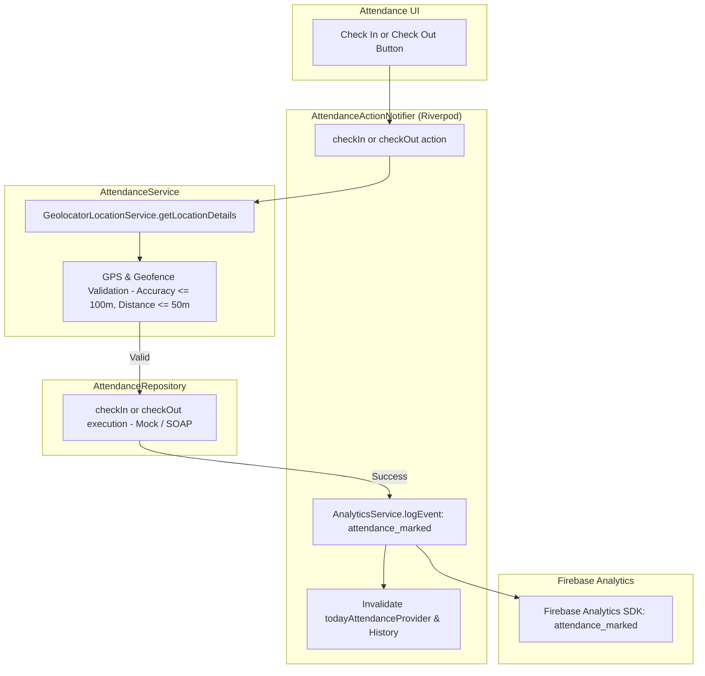

### Precise Attendance Rules
- **Office Coordinates**: Configured in application constants
- **Allowed Radius**: `50.0` meters
- **Maximum Allowed Accuracy Threshold**: `100.0` meters
- **Sequential Attendance States**: `notMarked` -> `checkedIn` -> `completed`
- **Telemetry**: Successful check-in/out execution in `AttendanceActionNotifier` triggers `analyticsServiceProvider.logEvent('attendance_marked')`.

---

## 11. Firebase Architecture

Firebase is configured in `lib/main.dart` using `firebase_core`, `firebase_analytics`, and `firebase_crashlytics`.

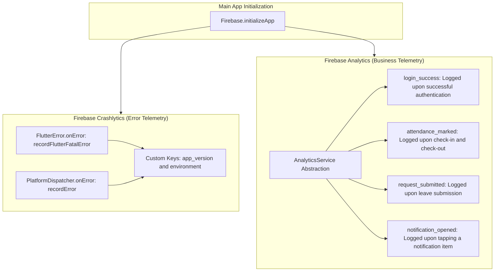

*Services Excluded*: FCM (Push Messaging), Firestore, Firebase Storage, Firebase Auth, Performance Monitoring, Remote Config, and App Check are **not configured** or present in the application code.

---

## 12. Payroll & PDF Architecture

The Payroll module handles annual payslip retrieval, structured detail viewing, arithmetic verification, and vector PDF document generation.

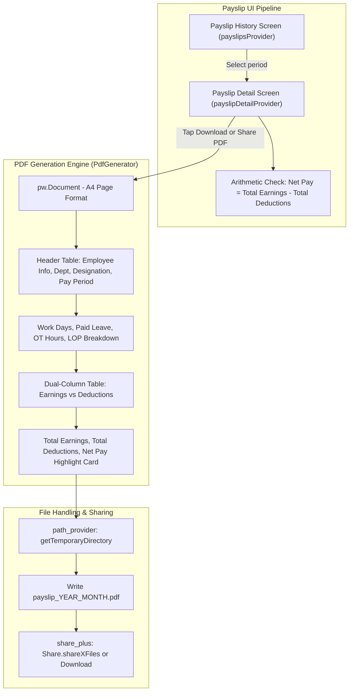

---

## 13. Notifications Architecture

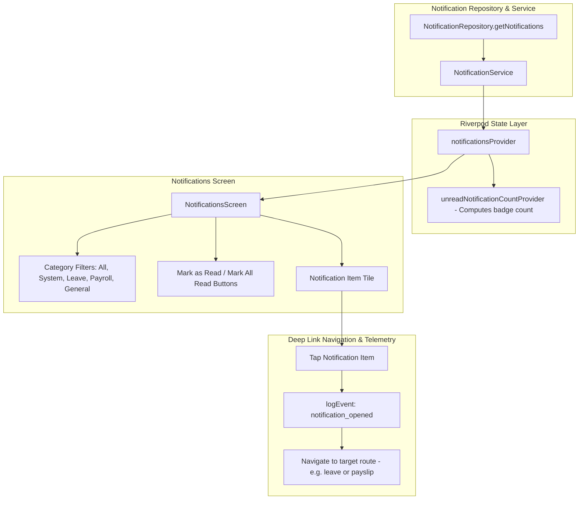

---

## 14. Requests Architecture

The Request Center consolidates workflows from 7 separate employee domains into a unified interface.

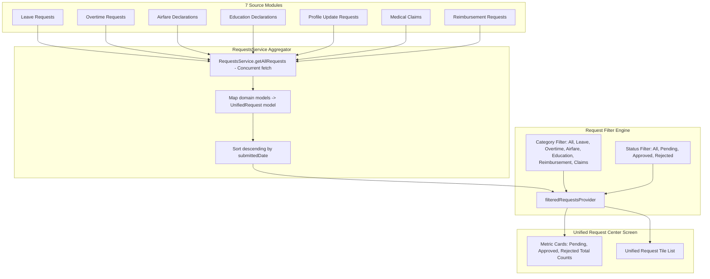

---

## 15. Profile & Documents Architecture

The Profile module provides comprehensive employee information through a main landing screen leading into 10 structured sub-sections:

```
ProfileScreen (/profile)
|
+-- PersonalInformationLandingScreen (/profile/personal-info)
|     +-- 1. Basic Information (/profile/basic-info)
|     +-- 2. Family Information (/profile/family)
|     +-- 3. Bank Information (/profile/bank)
|     +-- 4. Education History (/profile/education)
|     +-- 5. Education Documents (/profile/education-docs)
|     +-- 6. Skills (/profile/skills)
|     +-- 7. Identity Documents (/profile/identity)
|     +-- 8. Work History (/profile/work-history)
|     +-- 9. Certificates (/profile/certificates)
|     +-- 10. Profile Update Requests (/profile/requests)
|
+-- DocumentsScreen (/documents)
      +-- Direct Payslip PDF Navigation -> (/payslip/detail)
```

---

## 16. Testing Architecture

The codebase contains 27 automated test files under `test/`, validating unit logic, widget behavior, state providers, and end-to-end regression flows.

```
test/
|-- airfare_test.dart
|-- attendance_permission_test.dart
|-- attendance_service_test.dart
|-- attendance_test.dart
|-- auth_test.dart
|-- claims_reimbursement_test.dart
|-- complete_regression_test.dart
|-- dashboard_test.dart
|-- education_test.dart
|-- expenses_test.dart
|-- geofence_test.dart
|-- leave_test.dart
|-- navigation_test.dart
|-- notification_test.dart
|-- orders_test.dart
|-- overtime_test.dart
|-- payroll_test.dart
|-- personal_info_module_test.dart
|-- phase_9b_implementation_test.dart
|-- profile_documents_test.dart
|-- profile_settings_test.dart
|-- reimbursement_module_test.dart
|-- repository_test.dart
|-- requests_test.dart
|-- security_rules_test.dart
|-- serialization_test.dart
+-- soap_infrastructure_test.dart
```

### Verified Quality Assurance Status (from repository records)
- **Automated Tests**: 99 / 99 Tests Passing (0 Failures)
- **Static Analysis**: `flutter analyze` Passed with 0 issues
- **Build Verification**: Debug APK build verified
- **R8 Proguard**: Production minification rules configured in `android/app/build.gradle.kts`

---

## 17. Production Readiness

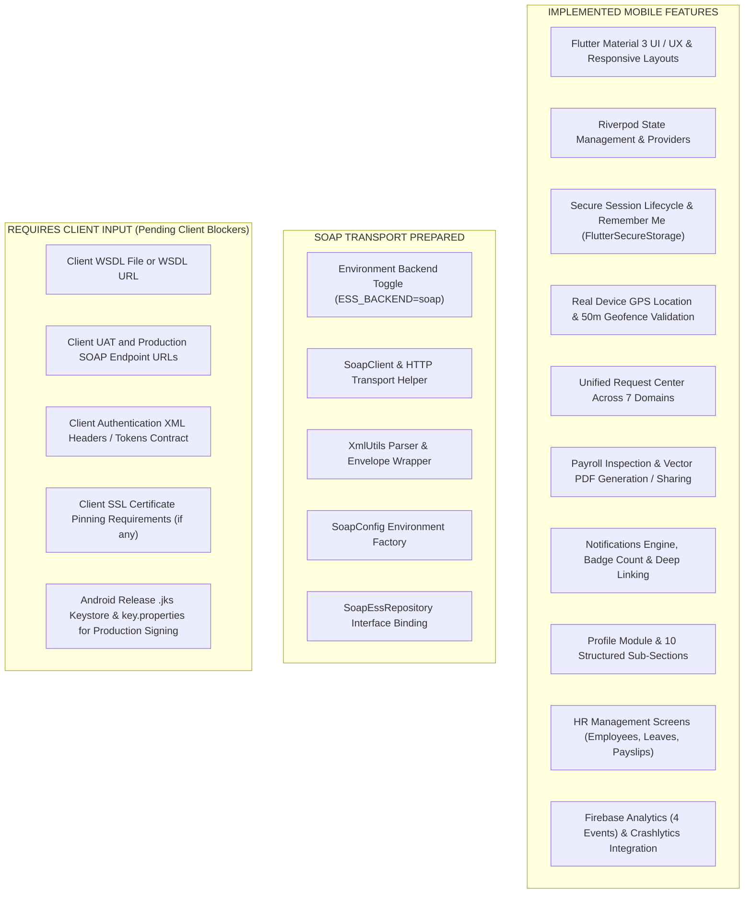

---

## 18. Complete Data Flow

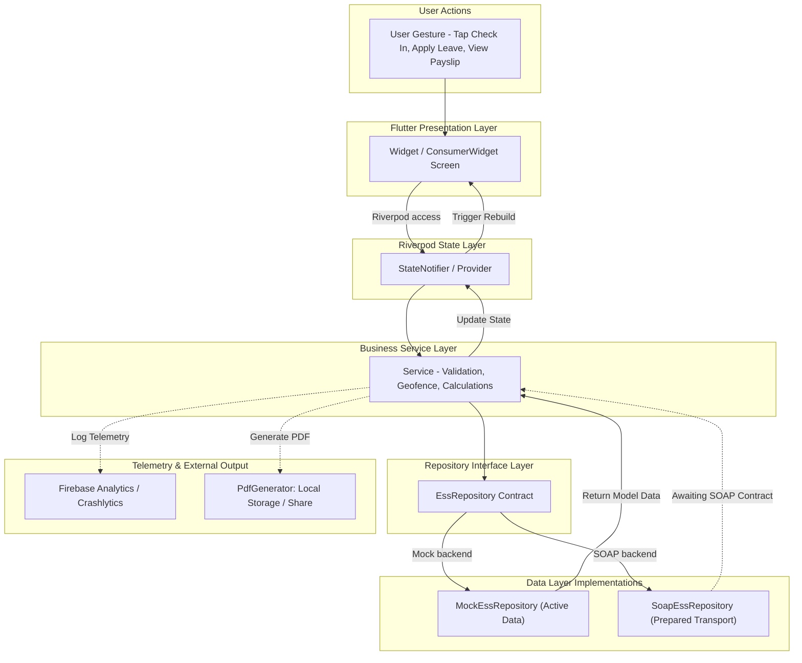

---

## 19. File Responsibility Matrix

| File / Folder | Layer | Responsibility | Key Dependencies |
| :--- | :--- | :--- | :--- |
| `lib/main.dart` | Entry Point | Initializes Firebase Core, Crashlytics error handlers, and runs `ProviderScope` | `firebase_core`, `firebase_crashlytics` |
| `lib/app.dart` | Application | Configures `MaterialApp`, theme, `navigatorKey`, named routes, and route generator | `flutter_riverpod`, `AppTheme` |
| `lib/core/constants/app_constants.dart` | Core | Centralized route names, office GPS coordinates, geofence radius (50m), max accuracy (100m), and spacing tokens | Core Dart |
| `lib/core/utils/session_manager.dart` | Core Utility | Secure encrypted session storage for tokens, user role, and remember me preferences | `flutter_secure_storage` |
| `lib/core/utils/pdf_generator.dart` | Core Utility | Builds vector A4 payslip PDF documents, writes temporary files, and invokes share sheet | `pdf`, `printing`, `path_provider`, `share_plus` |
| `lib/core/services/analytics_service.dart` | Core Service | Safe telemetry abstraction layer mapping custom business events to Firebase Analytics | `firebase_analytics` |
| `lib/core/providers/injection_providers.dart` | Core DI | Configures Riverpod dependency injection for repositories, services, and environment switching | `flutter_riverpod` |
| `lib/services/auth_service.dart` | Service | Manages authentication flow, session persistence, role detection, and logout | `AuthRepository`, `SessionManager` |
| `lib/services/attendance_service.dart` | Service | Validates GPS coordinates, 50m geofence, accuracy threshold, and attendance state rules | `AttendanceRepository`, `LocationService` |
| `lib/services/location_service.dart` | Service | Interfaces with device GPS hardware, calculates Haversine distance to office | `geolocator` |
| `lib/services/requests_service.dart` | Service | Aggregates requests from 7 distinct modules into unified `UnifiedRequest` models | Leave, Overtime, Airfare, Education, Profile, Expense Services |
| `lib/services/soap/soap_client.dart` | SOAP Infrastructure | Low-level HTTP transport layer for SOAP requests, XML headers, and SOAP Fault handling | `SoapConfig`, `XmlUtils` |
| `lib/services/soap/xml_utils.dart` | SOAP Utility | XML serialization, tag parsing, and SOAP envelope construction helpers | Core Dart |
| `lib/repositories/ess_repository.dart` | Repository Interface | Abstract master contract declaring all ESS data access methods | Data Models |
| `lib/repositories/mock_ess_repository.dart` | Repository Data | Deterministic mock repository implementation serving full ESS app data | `MockDataService` |
| `lib/repositories/soap_ess_repository.dart` | Repository Data | SOAP-backed repository implementation prepared for client WSDL binding | `SoapClient` |
| `lib/features/auth/login_screen.dart` | Presentation | Login UI form with credentials inputs, password visibility toggle, and Remember Me | `authServiceProvider`, `analyticsServiceProvider` |
| `lib/features/attendance/attendance_screen.dart` | Presentation | Attendance dashboard showing current day status, live GPS geofence indicator, and Check In/Out | `todayAttendanceProvider`, `attendanceActionProvider` |
| `lib/features/payslip/payslip_detail_screen.dart` | Presentation | Detailed earnings and deductions view, arithmetic verification, and PDF action buttons | `payslipDetailProvider`, `PdfGenerator` |
| `lib/features/requests/requests_screen.dart` | Presentation | Unified Request Center screen with category and status filter chips and metric cards | `filteredRequestsProvider`, `requestsFilterProvider` |
| `lib/features/notifications/notifications_screen.dart` | Presentation | Notification list screen with unread badge, category filter chips, and deep link navigation | `notificationsProvider`, `analyticsServiceProvider` |
| `lib/features/profile/personal_info_landing_screen.dart` | Presentation | Profile landing screen presenting 10 structured employee personal information sub-sections | `profileProvider` |
| `lib/features/hr/hr_dashboard_screen.dart` | Presentation | HR Administrator dashboard featuring high-level metrics and navigation tiles for HR workflows | `Riverpod` |

---

## 20. Architecture Summary

The **ESS Application** operates through a clean unidirectional data lifecycle:

1. **User Action**: The user interacts with Flutter UI widgets (e.g., tapping "Check In", applying for leave, or viewing a payslip).
2. **State Management**: The UI delegates the action to a **Riverpod** provider or `StateNotifier` via `ref.read()`.
3. **Business Validation**: The provider invokes the corresponding **Application Service** (e.g., `AttendanceService`), which enforces business rules (such as validating that device GPS accuracy is under 100 meters and distance to configured office location is within the allowed 50-meter geofence).
4. **Data Access Abstraction**: The service communicates through abstract **Repository Contracts** (`EssRepository`). The `essRepositoryProvider` dynamically resolves the contract to either the active deterministic `MockEssRepository` or the prepared `SoapEssRepository` based on the compile-time `--dart-define=ESS_BACKEND` environment flag.
5. **Telemetry & Side Effects**: As business actions complete successfully, non-blocking telemetry events (e.g., `attendance_marked`, `login_success`, `request_submitted`, `notification_opened`) are dispatched safely through `AnalyticsService` to **Firebase Analytics**, and fatal errors are captured by **Firebase Crashlytics**.
6. **Declarative UI Update**: The service returns updated data models to the Riverpod provider, which updates its state, causing all listening `ConsumerWidgets` to automatically rebuild and present the new UI state to the user.
