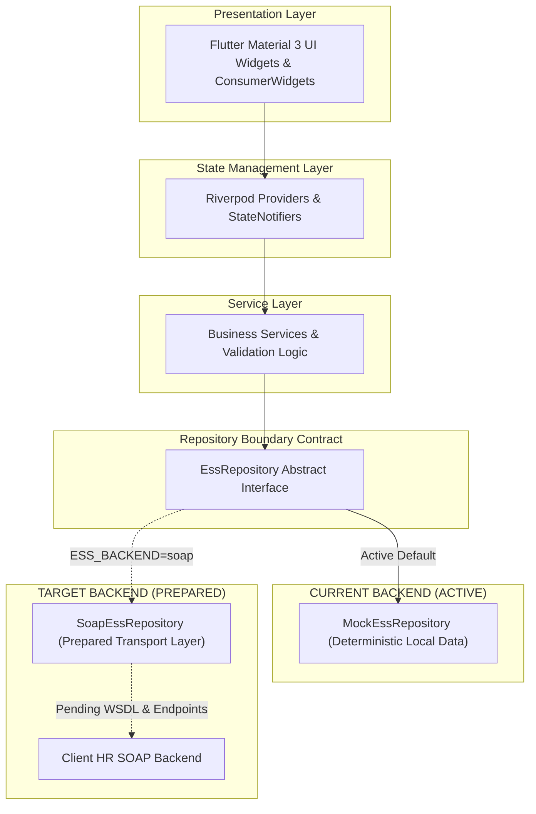
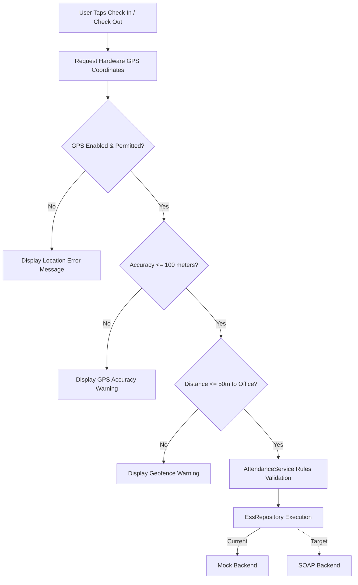
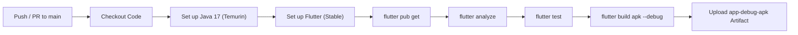
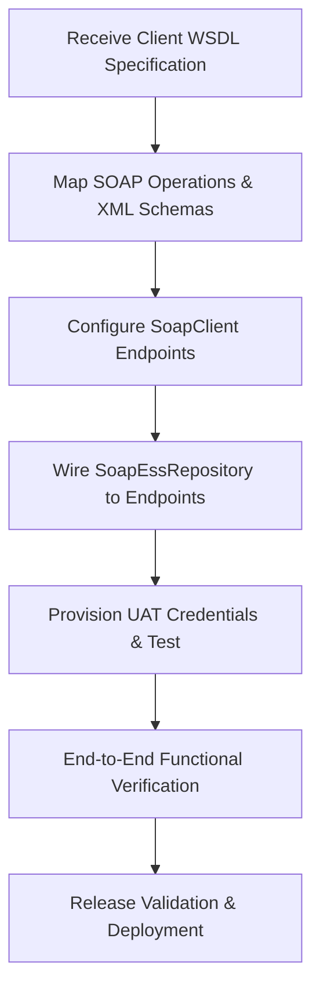

<p align="center">
  
</p>

<h1 align="center">ebaConnect</h1>

<p align="center">
  <b>Employee Self-Service (ESS) Mobile Application</b>
</p>

<p align="center">
  Flutter • Riverpod • SOAP/XML Ready • Firebase
</p>

<p align="center">
  <a href="https://flutter.dev"></a>
  <a href="https://dart.dev"></a>
  <a href="https://github.com/Aravindan-001/icore-ess/actions"></a>
  <a href="#quality--ci"></a>
  <a href="#quality--ci"></a>
</p>

---

## Quick Navigation

- [Overview](#overview)
- [Product Snapshot](#product-snapshot)
- [Features](#features)
- [Architecture](#architecture)
- [Attendance Flow](#attendance-flow)
- [Backend Integration Status](#backend-integration-status)
- [Quality & CI](#quality--ci)
- [Project Progress](#project-progress)
- [Demo Accounts](#demo-accounts)
- [Repository Structure](#repository-structure)
- [Next Integration Milestone](#next-integration-milestone)
- [Tech Stack](#tech-stack)
- [Documentation](#documentation)
- [Current Status](#current-status)

---

## Overview

**ebaConnect (iCore ESS)** is a enterprise Employee Self-Service (ESS) mobile application built with **Flutter** and **Dart**. The system streamlines workforce operations including location-based GPS attendance, leave applications, unified request management, payroll and payslip inspection, structured PDF document generation, and HR administration.

The mobile application is fully developed and hardened operating against a deterministic mock repository. The system is architecturally prepared for client SOAP/XML web service integration via `--dart-define=ESS_BACKEND=soap`.

---

## Product Snapshot

| Area | Status |
| :--- | :--- |
| **Mobile Platform** | Flutter (SDK `^3.12.1` / Dart 3.x) |
| **Role Support** | Employee & HR Administrator Roles |
| **Current Backend** | Deterministic Mock Repository (Active) |
| **SOAP/XML Integration** | Prepared Transport Layer (`ESS_BACKEND=soap`) |
| **Firebase Services** | Analytics + Crashlytics Configured |
| **Automated Tests** | 99 / 99 Tests Passing (0 Failures) |
| **Static Analysis** | `flutter analyze` — 0 Issues |
| **Debug APK Build** | Successful Gradle Compilation |
| **Client WSDL** | Pending Client Delivery |
| **UAT Environment** | Pending Client Delivery |

---

## Features

### Employee Experience

- **Home Dashboard**: Real-time attendance status card, quick navigation shortcuts, unread notification badge, latest net pay summary, and pending request metrics.
- **Personal Information**: Employee profile summary leading to a 10-section structured information portal (Basic, Family, Bank, Education, Education Docs, Skills, Identity, Work History, Certificates, Profile Requests).
- **Salary & Benefits**: Breakdown of compensation structures, allowances, basic pay, and benefits overview.
- **Leave Management**: Leave balance indicators, leave application form with date validation, and request history tracking.
- **Attendance**: GPS check-in/out with live geofence status indicator, accuracy checking, and attendance history logs.
- **Unified Request Center**: Centralized request hub aggregating workflows from 7 employee domains (Leave, Overtime, Airfare, Education, Profile Update, Medical Claims, Reimbursements) with category and status filter chips.
- **Notifications & Alerts**: Category filtering (System, Leave, Payroll, General), unread filtering, mark as read, and deep-link navigation.
- **Payslips & Pay Summary**: Annual payslip history, detailed earnings/deductions breakdown, YTD metric calculations, and vector A4 PDF generation and sharing (`PdfGenerator`).
- **Documents**: Centralized document view with direct deep links to payslip PDFs.
- **Profile**: Comprehensive employee identity card and account management.

### HR Experience

- **HR Dashboard**: High-level administrative metrics and workforce management shortcut tiles.
- **Employee Management**: Roster view of employees with profile inspection capability.
- **Leave Management**: Approval/rejection workflow for pending employee leave applications.
- **Payroll & Payslip Management**: Organization-wide employee payslips inspection and earnings review.
- **Role Isolation**: Role-based access control protecting HR workflows from general employee accounts.

---

## Architecture

The application enforces a **Clean Layered Architecture** separating presentation, state management, business rules, and repository contracts:



### Repository Boundary Rationale

The abstract repository boundary (`EssRepository`) decouples presentation and business service layers from underlying data providers. This architecture allows swapping the active deterministic `MockEssRepository` for the prepared `SoapEssRepository` without altering UI widgets, state providers, or domain services.

---

## Attendance Flow



> **Client vs. Server Geofencing Note**
>
> The 50-meter geofence and 100-meter accuracy validations are currently enforced on the Flutter client side to provide immediate user feedback. Authoritative server-side validation will be executed by the client backend upon SOAP service integration.

---

## Backend Integration Status

| Integration Area | Current State | Notes |
| :--- | :--- | :--- |
| **Mock Repository** | **Active** | Full app functionality available offline using mock data |
| **SOAP Client Layer** | **Prepared** | `SoapClient` HTTP transport and fault handling ready |
| **SOAP Repository** | **Prepared** | `SoapEssRepository` implementation structure bound |
| **XML Utilities** | **Prepared** | `XmlUtils` envelope builder and tag parser ready |
| **Client WSDL File** | **Awaiting Client** | Pending delivery from client technical team |
| **SOAP Operation Names** | **Awaiting Client** | Pending official API contract documentation |
| **XML Request/Response Schemas**| **Awaiting Client** | Pending payload structure definition |
| **Endpoint URLs** | **Awaiting Client** | UAT and Production endpoints pending |
| **Authentication Specification** | **Awaiting Client** | XML Header / Token contract pending |
| **UAT Credentials** | **Awaiting Client** | Credentials pending for integration testing |
| **End-to-End Integration** | **Not Started** | Blocked until client inputs are delivered |

> **Integration Callout**
>
> The Flutter application is architecturally prepared for SOAP/XML integration. The real HR backend cannot be connected until the client's WSDL, endpoint URLs, SOAP operations, schemas, and UAT credentials are available.

---

## Quality & CI

| Check | Result | Specification / Details |
| :--- | :---: | :--- |
| **Static Analysis** | **0 Issues** | Verified via `flutter analyze` |
| **Automated Tests** | **99 / 99 Passed** | 27 test files covering unit, widget, and provider tests |
| **Debug APK Build** | **Success** | Compiled via `flutter build apk --debug` |
| **GitHub Actions CI** | **Passing** | Automated workflow on Ubuntu 24.04 with Java 17 |
| **Crashlytics** | **Configured** | Fatal and non-fatal error telemetry handler attached |
| **Analytics** | **Configured** | Safe business telemetry mapped to Firebase Analytics |

### CI Pipeline Workflow



The GitHub Actions workflow (`.github/workflows/flutter-ci.yml`) automatically validates code quality, executes tests, builds the debug APK, and archives the build artifact on every push or pull request to `main`.

---

## Project Progress

```
Phase 1 — Navigation Architecture       [COMPLETE]
Phase 2 — Home Dashboard                 [COMPLETE]
Phase 3 — Personal Information           [COMPLETE]
Phase 4 — Salary & Benefits              [COMPLETE]
Phase 5 — Leave Management               [COMPLETE]
Phase 6 — Attendance Management           [COMPLETE]
Phase 7 — Requests & Workflow             [COMPLETE]
Phase 8 — Notifications & Alerts         [COMPLETE]
Phase 9 — Architectural Cleanup           [COMPLETE]
Phase 10 — Firebase / Branding            [COMPLETE]
Phase 11A — Attendance Experience        [COMPLETE]
Phase 11B — Notifications UX             [COMPLETE]
Phase 11C — Request Center               [COMPLETE]
Phase 11D — Payroll & Payslips            [COMPLETE]
Phase 11E — Profile & Documents           [COMPLETE]
Phase 11F — Production Hardening          [COMPLETE]
```

- **Current Milestone**: Client SOAP/WSDL Integration
- **Pending Deliverables**: Client WSDL → Operation Mapping → SOAP Repository Integration → UAT Testing → Release Validation

---

## Demo Accounts

<details>
<summary><b>Employee Demo Account</b> (Click to expand)</summary>

- **Employee ID**: `20140`
- **Password**: `Employee@123`
- **Role**: Employee
- **Name**: ANITHA K
- **Department**: RETAIL
- **Designation**: EXECUTIVE-SALES-ELIFE
- **Location**: DUBAI
- **Currency**: AED

</details>

<details>
<summary><b>HR Admin Demo Account</b> (Click to expand)</summary>

- **Employee ID**: `HR001`
- **Password**: `HR@12345`
- **Role**: HR Admin
- **Designation**: HR Manager
- **Department**: Management
- **Title**: CTO

</details>

*Note: These credentials operate against deterministic mock data for development and demonstration purposes.*

---

## Repository Structure

```
lib/
├── app.dart                        # MaterialApp configuration, theme & route generator
├── main.dart                       # Entry point & Firebase initialization
├── core/                           # Application core infrastructure
│   ├── constants/                  # Office GPS coordinates, routes & spacing tokens
│   ├── errors/                     # AppExceptions & failure models
│   ├── providers/                  # Dependency injection providers
│   ├── services/                   # Analytics service abstraction
│   ├── theme/                      # AppTheme Material Design 3 setup
│   ├── utils/                      # SessionManager, PdfGenerator & AppLogger
│   └── widgets/                    # Reusable UI widgets
├── features/                       # Feature modules
│   ├── attendance/                 # GPS attendance screen & geofence widgets
│   ├── auth/                       # Login screen & bootstrap handler
│   ├── dashboard/                  # Home dashboard, metrics & shortcuts
│   ├── hr/                         # HR dashboard, roster & approvals
│   ├── leave/                      # Leave balances & application form
│   ├── notifications/              # Notifications list & category filtering
│   ├── payslip/                    # Payslip history & detail breakdown
│   ├── profile/                    # Personal info landing & 10 sub-sections
│   └── requests/                   # Unified request center across 7 domains
├── models/                         # Domain data models (Employee, Attendance, Payslip, etc.)
├── navigation/                     # Main navigation hub & bottom bar
├── repositories/                   # Abstract contracts & repository implementations
│   ├── ess_repository.dart         # EssRepository interface contract
│   ├── mock_ess_repository.dart    # Active deterministic mock implementation
│   └── soap_ess_repository.dart    # Prepared SOAP/XML repository
└── services/                       # Business services & transport layers
    ├── attendance_service.dart     # Attendance rules & geofence check
    ├── location_service.dart       # Device GPS hardware interface
    ├── requests_service.dart       # Request aggregator
    └── soap/                       # SoapClient, XmlUtils & SoapConfig

test/                               # 27 test files (99 passing tests)
assets/                             # Branding assets and images
.github/workflows/flutter-ci.yml    # GitHub Actions CI pipeline
ARCHITECTURE.md                     # Architecture documentation
BACKEND_INTEGRATION.md              # Backend integration guide
PRODUCTION_READINESS.md             # Production hardening checklist
SECURITY.md                         # Security policy
SECURITY_AUDIT.md                   # Security audit report
```

---

## Next Integration Milestone



---

## Tech Stack

| Layer | Technology | Version / Details |
| :--- | :--- | :--- |
| **Framework** | Flutter | SDK `^3.12.1` |
| **Language** | Dart | 3.x |
| **UI Framework** | Material Design 3 | Light Theme, Google Fonts `^8.2.1`, Cupertino Icons `^1.0.8` |
| **State Management** | Riverpod | `flutter_riverpod: ^2.6.1` |
| **Backend Architecture** | Repository Pattern | Toggleable via `--dart-define=ESS_BACKEND` |
| **Session & Storage** | Flutter Secure Storage | `flutter_secure_storage: ^9.2.4` via `SessionManager` |
| **Location & GPS** | Geolocator | `geolocator: ^13.0.4` |
| **PDF Generation** | PDF & Printing | `pdf: ^3.11.1`, `printing: ^5.11.1`, `share_plus: ^10.1.3` |
| **Telemetry** | Firebase | Analytics (`firebase_analytics`) & Crashlytics (`firebase_crashlytics`) |
| **CI / Automation** | GitHub Actions | Runner `ubuntu-24.04`, Java 17 Temurin, Flutter Stable |
| **Target OS** | Android | Gradle KTS, Java JVM 17 |

---

## Documentation

- [`ARCHITECTURE.md`](ARCHITECTURE.md) — System architecture, state management, and data flow specifications
- [`BACKEND_INTEGRATION.md`](BACKEND_INTEGRATION.md) — SOAP/XML integration roadmap, transport layer, and WSDL readiness
- [`PRODUCTION_READINESS.md`](PRODUCTION_READINESS.md) — Production hardening checklist, security audit, and build details
- [`SECURITY.md`](SECURITY.md) — Security policy, data protection, and disclosure guidelines
- [`SECURITY_AUDIT.md`](SECURITY_AUDIT.md) — Security controls, session storage rules, and threat review
- [`CHANGELOG.md`](CHANGELOG.md) — Complete project release and phase history

---

## Current Status

> **Current Status**
>
> Flutter application QA and hardening complete.
> The application operates against the active deterministic mock repository and is architecturally prepared for SOAP/XML integration.
>
> **Next Blocker**: Client WSDL, SOAP operation contracts, endpoint configuration, XML schemas, and UAT credentials.
