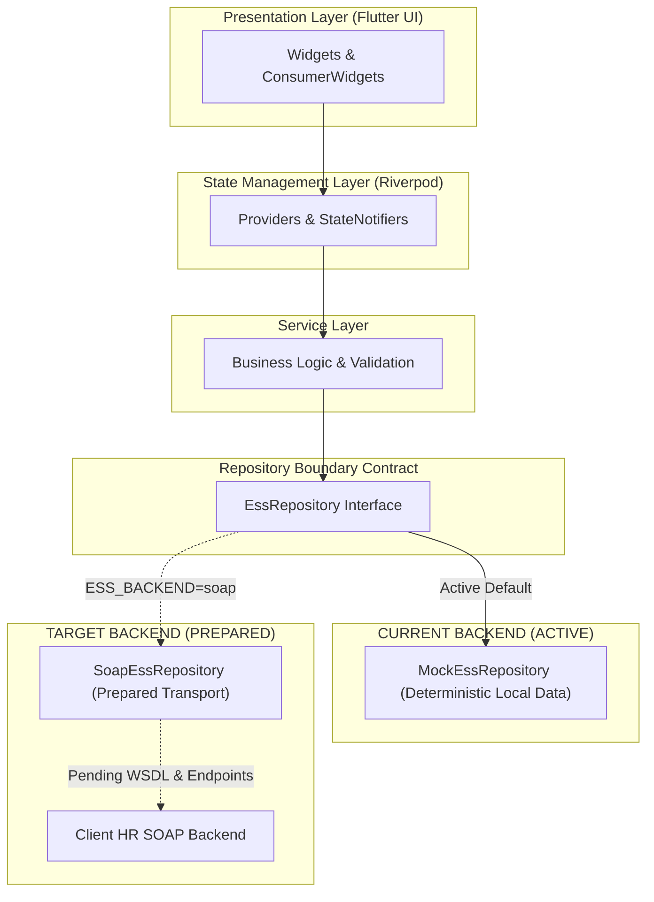

# ebaConnect / iCore ESS — UX & Wireframe Specification Package

This document serves as the master index for the reverse-engineered UX and wireframe specification package of the **ebaConnect / iCore ESS** Flutter application. Every wireframe specification, layout diagram, and user flow in this package directly reflects the implemented codebase.

---

## Wireframe Package Index

```
docs/
└── wireframes/
    ├── SCREEN_INVENTORY.md         # Master catalog of all 45 screens and routes
    ├── USER_FLOWS.md               # 11 Mermaid navigation and business flow diagrams
    ├── EMPLOYEE_WIREFRAMES.md      # Detailed specs & ASCII wireframes for Employee screens
    ├── HR_WIREFRAMES.md            # Detailed specs & ASCII wireframes for HR screens
    └── SHARED_COMPONENTS.md        # Specifications for reusable UI components & widgets
```

---

## Screen Inventory Overview

The application contains **45 cataloged screens and views** categorized across authentication, employee core features, personal information portal, and HR administration:

| Category | View Count | Key Screens |
| :--- | :---: | :--- |
| **Authentication & Shells** | 5 | Bootstrap, Login, Change Password, Forgot Password, Main Navigation Hub |
| **Employee Core Modules** | 25 | Home Dashboard, Attendance, Leave, Apply Leave, Payslips, Payslip Detail, Pay Summary, Salary & Benefits, Overtime, Airfare, Education, Reimbursement, Claims, Pre-Order, Sales Order, Request Center, Notifications, Documents, Settings, Services Catalog, Profile |
| **Personal Info Portal** | 11 | Personal Info Landing + 10 Sub-sections (Basic, Family, Bank, Education, Education Docs, Skills, Identity, Work History, Certificates, Profile Requests) |
| **HR Admin Portal** | 4 | HR Dashboard, Employee Directory, Leave Approvals, HR Payroll Management |

For the full route-by-route table, see [`docs/wireframes/SCREEN_INVENTORY.md`](docs/wireframes/SCREEN_INVENTORY.md).

---

## User Flows Summary

The package includes 11 complete Mermaid navigation and business diagrams in [`docs/wireframes/USER_FLOWS.md`](docs/wireframes/USER_FLOWS.md):

1. **Authentication & Session Flow** (`BootstrapScreen` -> `LoginScreen` -> Role Check -> MainNavigation)
2. **Employee Main Navigation Flow** (Bottom Navigation Bar tabs: Home, Payslips, Leave, Pay Summary, Profile)
3. **Location-Based GPS Attendance Flow** (GPS request -> Permission/Accuracy validation -> 50m Geofence -> Check In/Out)
4. **Leave Application & Unified Request Flow** (LeaveScreen -> ApplyLeaveScreen -> Unified Request Center)
5. **Payroll, Payslip & Vector PDF Flow** (PayslipScreen -> PayslipDetailScreen -> `PdfGenerator` -> Share Sheet)
6. **Notifications & Deep-Link Routing Flow** (AppBar Bell -> NotificationsScreen -> Deep Link Dispatch)
7. **Personal Information Portal Flow** (ProfileScreen -> Personal Info Landing -> 10 Sub-sections)
8. **My Documents Navigation Flow** (ProfileScreen -> DocumentsScreen -> Direct Payslip PDF link)
9. **HR Administrator Navigation Flow** (HR MainNavigation tabs: Admin, Employees, Leaves, Payroll, Profile)
10. **HR Leave Management Flow** (Pending Leaves -> Approve/Reject Decision)
11. **HR Payroll Inspection Flow** (HR Payslips -> Select Employee/Period -> Inspect Breakdown)

---

## Architectural Data Boundary



*Architectural Boundary Note*:
The presentation wireframes and user flows interact with the Riverpod state management layer and application services. All data operations resolve through the `EssRepository` interface contract, currently serving deterministic local mock data (`MockEssRepository`). The `SoapEssRepository` transport layer is fully prepared to connect to the client's HR backend upon delivery of the WSDL specification.

---

## Verification & Traceability

All documented wireframes specify exact code file paths, Riverpod providers, business services, repository interfaces, and named routes, ensuring 100% implementation traceability for developers and UI/UX designers.
