# ebaConnect / iCore ESS — User Flows & Navigation Diagrams

This document contains Mermaid diagrams illustrating the primary user navigation flows, session handling, business operations, and role-based routing implemented in the application.

---

## 1. Authentication & Session Flow

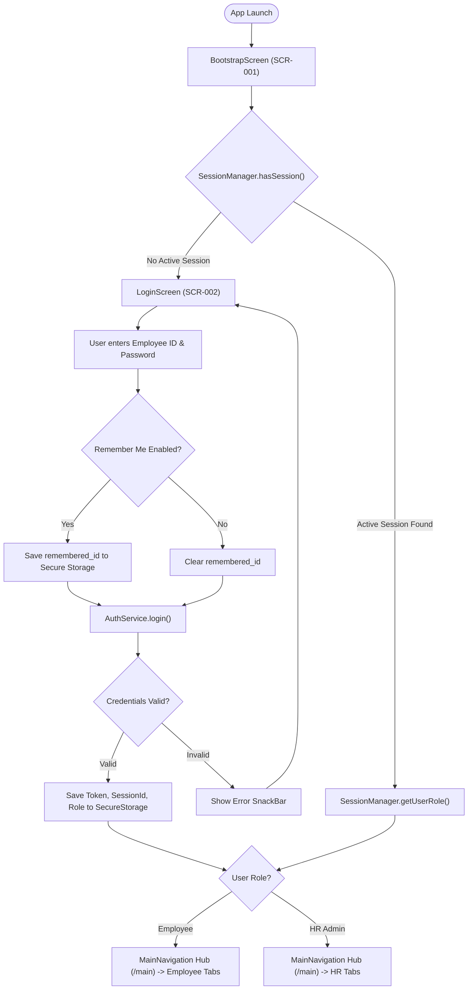

---

## 2. Employee Main Navigation Flow

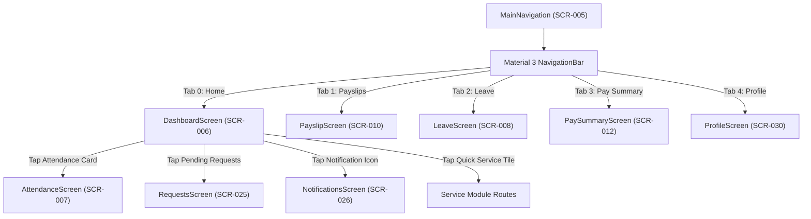

---

## 3. Location-Based GPS Attendance Flow

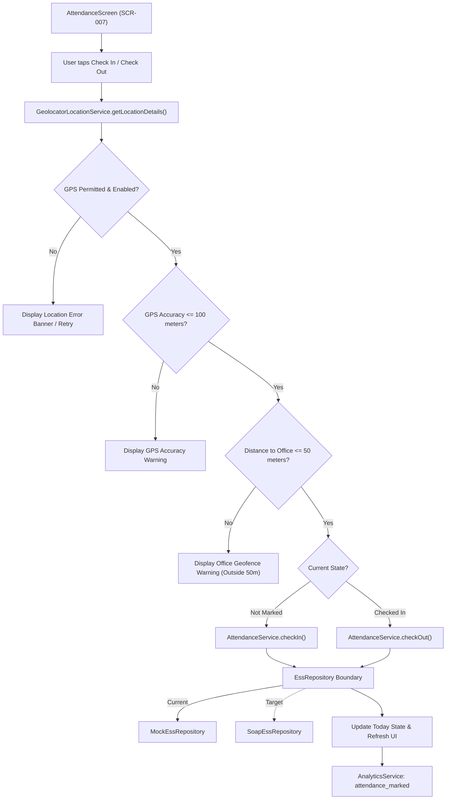

---

## 4. Leave Application & Unified Request Flow

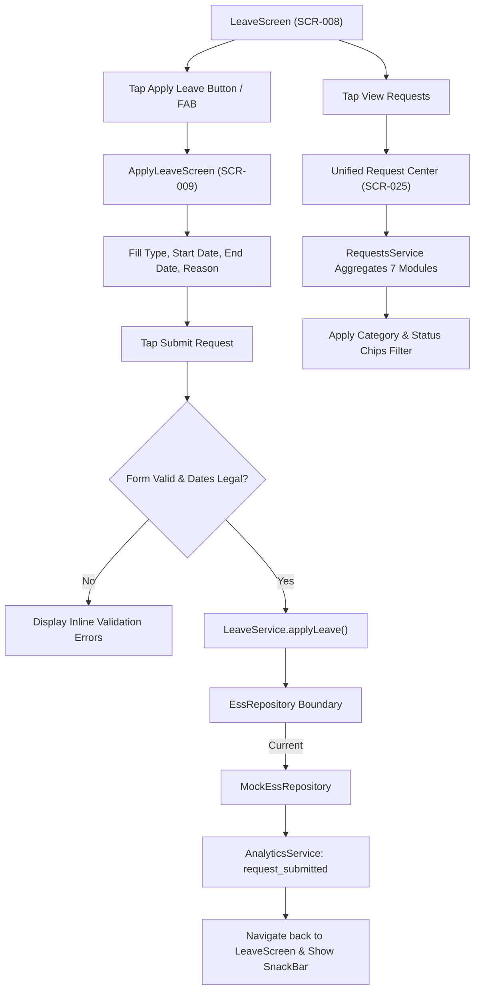

---

## 5. Payroll, Payslip & Vector PDF Generation Flow

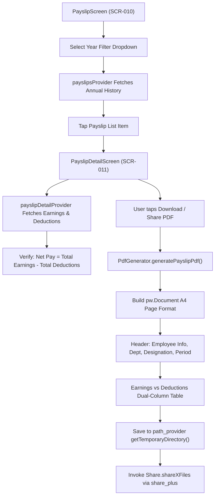

---

## 6. Notifications & Deep-Link Routing Flow

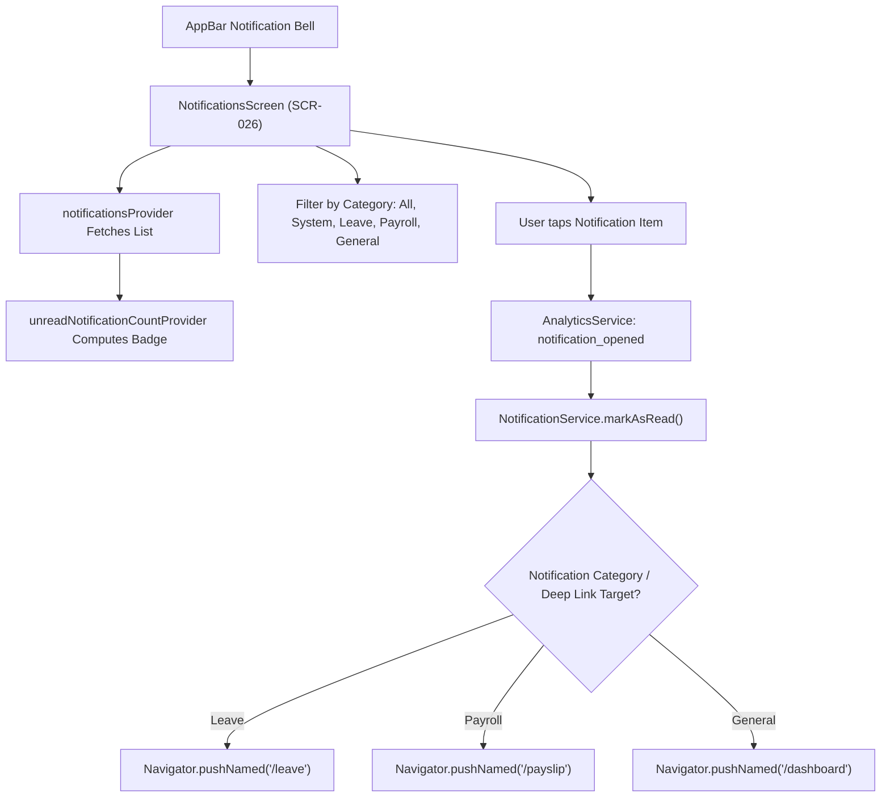

---

## 7. Personal Information Portal Flow

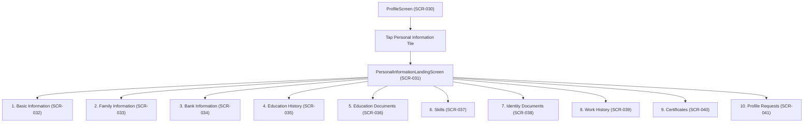

---

## 8. My Documents Navigation Flow

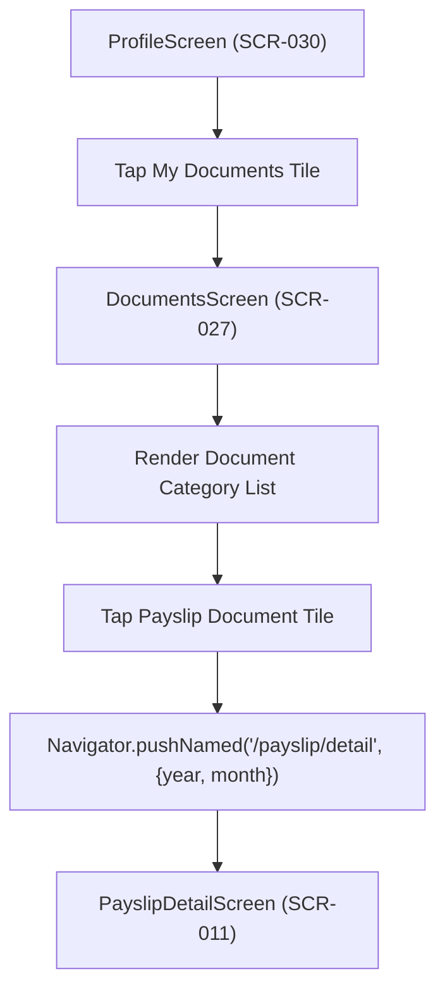

---

## 9. HR Administrator Navigation Flow

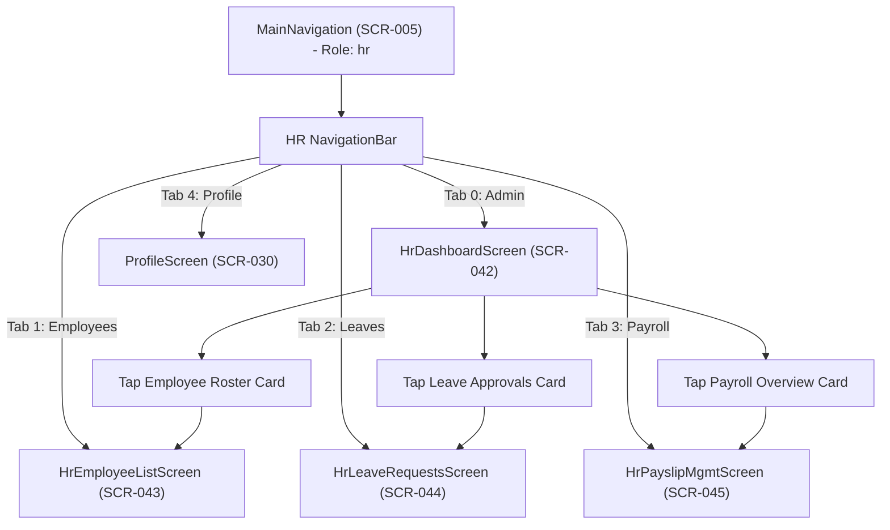

---

## 10. HR Leave Management & Approval Flow

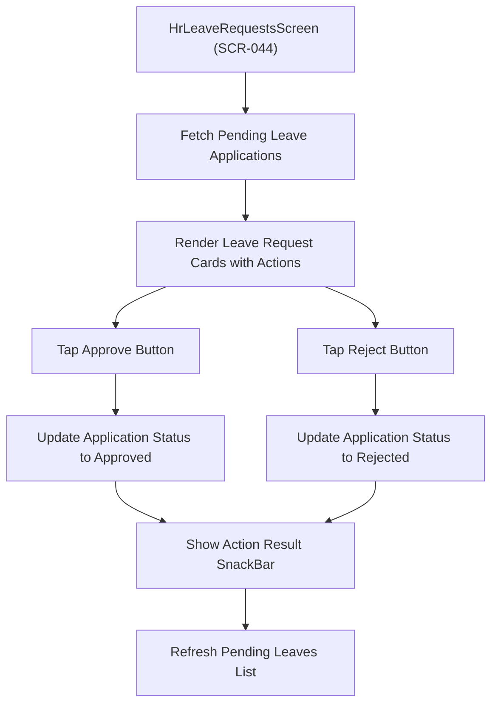

---

## 11. HR Payroll & Payslip Inspection Flow

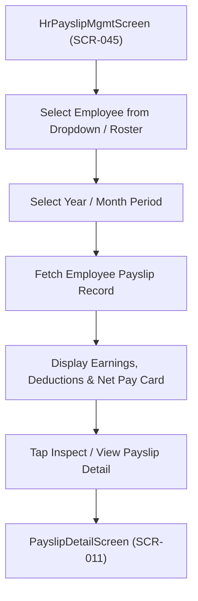
